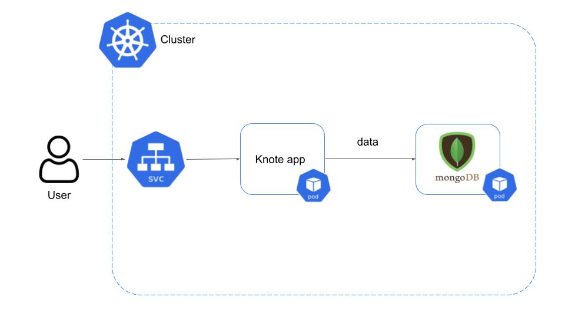
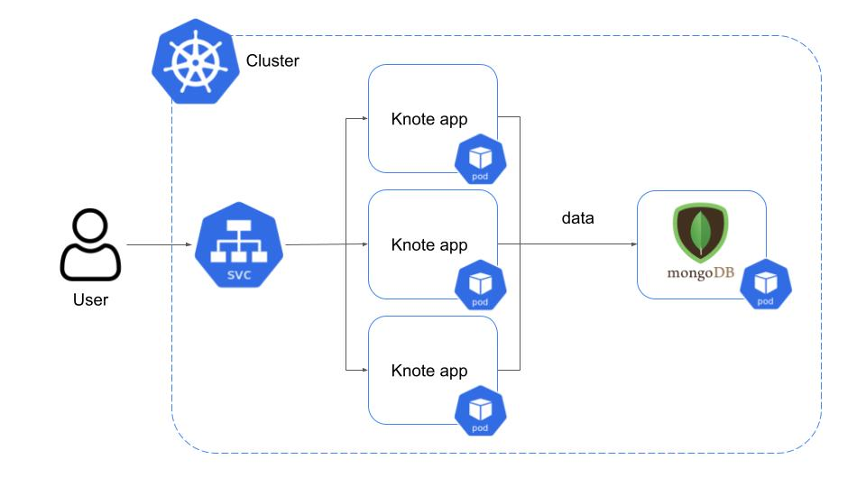
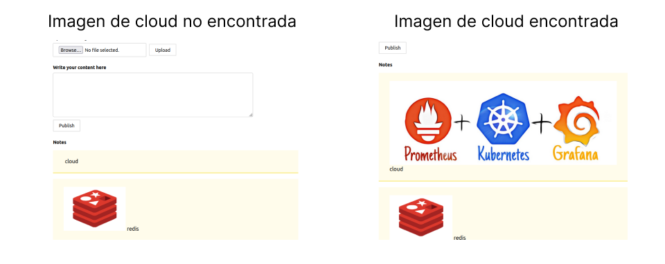
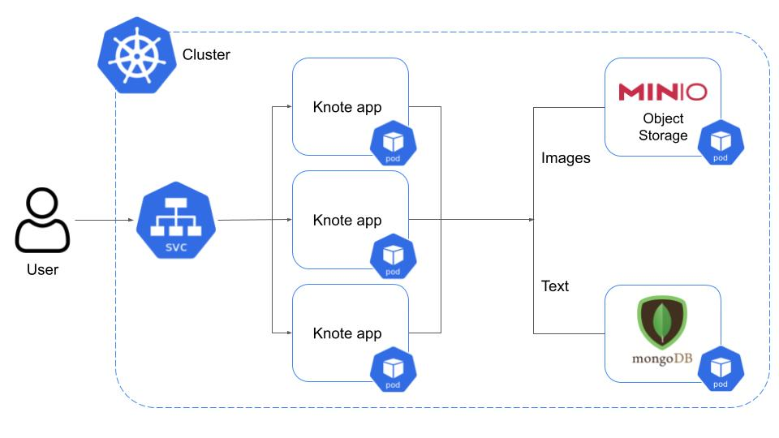
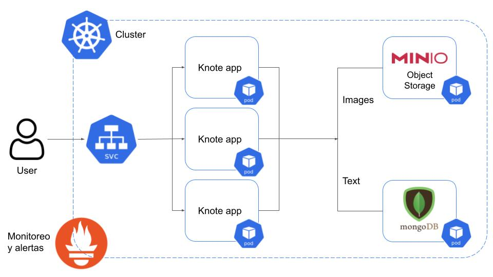
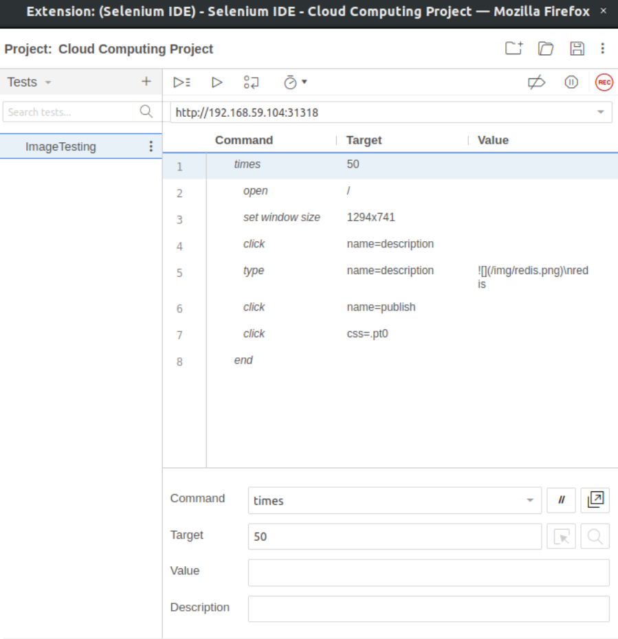

# proyecto-cloud

|  **#** | **Código** | **Apellidos, Nombre** |
| :---: | :---: | :---: |
|  1 | 201810112 | Bacigalupo, Renato|
|  2 | 201810554 | Barreto Zavaleta, Jeanlee |

## Knote

Aplicación que usa Exprees.js, Node.js y MongoDB

## Funcionalidad

El usuario selecciona una imagen, agrega un comentario y se guarda en su lista personal.

Elegimos esta aplicación porque cuenta con los componentes de backend, frontend y una base de datos que ayuda a persistir la información brindada por un usario. 

Considerando lo anterior, las características que se pueden integrar a esta aplicación son la escalabilidad, el monitoreo, el stateless, resiliencia y confiabilidad.

## Ejecución

### Local

Para correr la aplicación localmente debe de tener MongoDB y NPM instalados en su computador.

Una vez instalados debe copiar el repositorio y descargar las dependencias medinate el siguiente comando

    git clone https://github.com/JeanleeRoy/proyecto-cloud
    cd proyecto-cloud
    npm install

Para levantar la aplicación debe ejecutar el siguiente comando

    npm run start

La aplicación estará en la siguiente ruta http://localhost:3000

## Contenerización de la aplicación

En esta sección vamos a convertir la aplicación en un contenedor Docker. En el `Dockerfile` se especifica la copia de los ficheros del programa que pasarán a la imagen ubuntu (alpine) con Node.js instalado.

    FROM node:16.15.1-alpine3.16
    COPY . .
    RUN npm install
    CMD [ "node", "index.js" ]

Con el siguiente comando se construye la imagen de la aplicación Knote considerando el Dockerfile previo

    docker build -t knote .

### Corriendo en Docker

La base de datos MongoDB también se puede correr como un conenedor Docker. Pero antes se tiene que establecer la conexión para que ambos contenedores (el de `knote` y el de `mongo`) se alcancen.

El siguiente comando nos ayuda a crear un Docker Network para estos contenedores:

    docker network create knote

Para correr MongoDB como contenedor usa el siguiente comando:
    
    docker run -d --name=mongo --network=knote mongo

Y el siguiente es para la aplicación Knote:

    docker run --name=knote --network=knote -p 3000:3000 \
        -e MONGO_URL=mongodb://mongo:27017/dev knote

> Aquí puedes reemplazar la imagen local `knote` por una ya subida a Docker Hub `jeanlee23/knote-js`

**Nota:** la variable de entorno `MONGO_URL` tiene como valor de hostname `mongo`, precisamente este es el nombre que se le asigno al contenedor de MongoDB mediante el flag `--name=mongo`

Ahora se puede acceder a la aplicación corriendo en Docker desde la ruta http://localhost:3000/

## Kubernetes

Para crear un cluster kubernetes se requiere la instalación de Minikube y kubectl (este último necesita de un hipervisor, lo más común es usarlo con VirtualBox).

Con Minikube instaldo, puedes crear el clúster con el siguiente comando:

    minikube start --vm

Con el comando completado, puedes verificar que el cluster está creado con:

    kubectl cluster-info

Para hacer el deploy en el clúster de kubernetes utiliza el siguiente comando:

    kubectl apply -f kubernetes

El comando manda todos los archivos YAML del directorio `kubernetes`

Para acceder a la aplicación desplegada utiliza el siguiente comando:

    minikube service knote --url

La arquitectura a alto nivel de nuestra aplicación desplegada en kubernetes sería la siguiente:

## Escalabilidad

La ventaja que nos brinda Kubernetes con el manejo de nuetros contenedores para la aplicación y la base de datos en disitntos pods es que podemos escalar la aplicación de forma sencilla.

Lo que tenemos que realizar para lograr esto es hacer varias réplicas del pod `knote` mediante el siguiente comando:

    kubectl scale --replicas=3 deployment/knote

Por si solo este comando solo se encarga de las replicas, pero para que los pods puedan ser accedidos por el usuario nos apoyamos del servicio de tipo LoadBalancer que creamos cuando desplegamos la aplicación en kubernetes (el detalle de este servico se puede ver en el manifiesto [knote.yaml](kubernetes/knote.yaml))

Ahora cuando mostramos los pods de nuestro cluster vemos a los tres de `knote` y el correspondiente a la base de datos `mongo`

    NAME                    READY   STATUS    RESTARTS        AGE
    knote-599cb59959-klm5n  1/1     Running   1 (12h ago)     12h
    knote-599cb59959-ksh6r  1/1     Running   1 (12h ago)     12h
    knote-599cb59959-lzc9v  1/1     Running   1 (12h ago)     13h
    mongo-786dcc9b86-n6czn  1/1     Running   1 (12h ago)     13h

La arquitectura del cluster hasta este punto es la siguiente.

## Statefulness

Un problema que ocurre cuando realizamos las replicas es que las imágenes que subimos no siempre se visualizan. Esto se debe a que cada pod knote guarda las imagenes en su propio *file system* de manera local. Entonces, cuando el LoadBalancer redirige las peticiones para renderizar las imagenes en el navegador hacia alguno de los pods knote, habrá situaciones en las que el pod selecionado no tenga la imagen y por ende esta no se podrá visualzar. A continución se muestra una evidencia de dicha situación.

Para corregir esto lo que hicimos fue utilizar [MinIO](https://github.com/minio/minio), un servicio de almacenamiento de objetos de código abierto. Con MinIO las imagenes se pueden guardar en un lugar central donde todos los pods pueden acceder a ellas. Así es como quedaría nuestra arquitectura luego de agregar MinIO a la aplicación:

Con knote (y sus replicas) como la aplicación primaria para crear las notas, MongoDB para almacenar el texto de las notas y MinIO para guardar las imagenes de las notas.

Para lograr esta arquitectura tuvimos que crear una nueva imagen de nuestra aplicación con soporte para MinIO. Se modificó el `index.js` y se empaquetó la aplicación en la imagen `jeanlee23/knote-js:2.0.0` la cual espera tres variables de entorno adicionales:

1. `MINIO_HOST`: corresponde al nombre del contenedor MinIO.
2. `MINIO_ACCESS_KEY`: la clave para acceder al pod MinIO.
3. `MINIO_SECRET_KEY`: el secreto que debe presentar junto con la clave para autenticarse con MinIO

Se cambió el recurso de Deployment en `knote.yaml` con la nueva imagen y las variables adicionales. Así mismo, se agregó un nuevo maniefiesto `minio.yaml` donde se estableció la configuración completa con la definición del Deployment, Service y el PersistenVolumeClaim necesarios para MinIO.

Por último, eliminamos la versión anterior de la aplicación del clúster y desplegamos la aplicación con las nuevas configuraciones con el comando:

    kubectl apply -f kubebernetes

## Monitoreo

## Testing

Para hacer un script para probar la app, utilizamos la aplicación Selenium. Esta tiene distintas vistas, nosotros utilizamos el IDE, ya que es más gráfico y permite ver la ejecución. Luego, creamos el siguiente script:

Este sube una nueva nota a la nube, y este proceso se repite una cantidad de veces.

## Trabajo futuro

Para un trabajo futuro podríamos intentar agregar más funcionalidad a las features mostradas anteriormente. Por ejemplo, podríamos automatizar nuestro proceso de escalar la aplicación con Auto-Scaling. Además, podemos mejorar nuestra implementación de extractores para agregar uno al servicio de LoadBalancing de nuestra aplicación. Así podemos monitorear ese servicio importante directamente.
