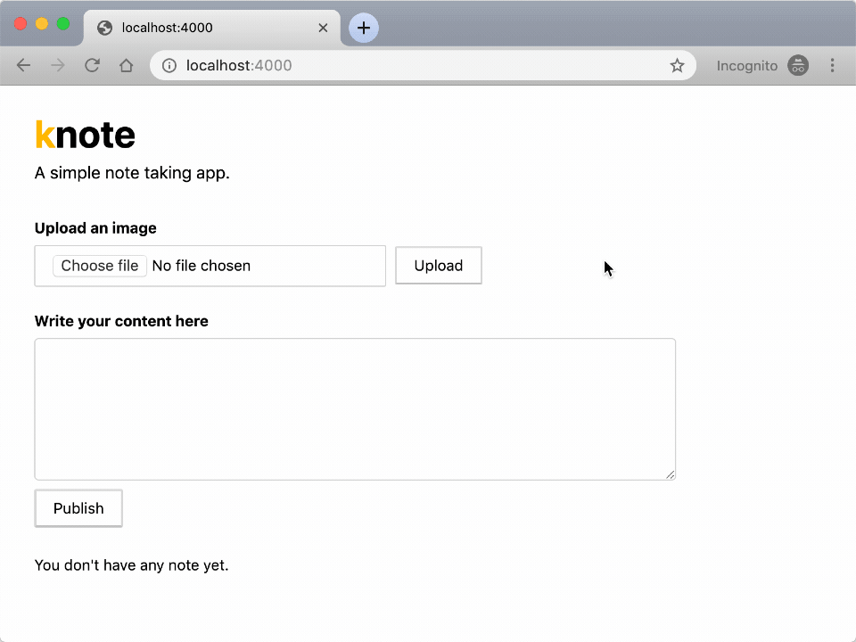

# proyecto-cloud

|  **#** | **Código** | **Apellidos, Nombre** |
| :---: | :---: | :---: |
|  1 | 201810112 | Bacigalupo, Renato|
|  2 | 201810554 | Barreto Zavaleta, Jeanlee |

## Knote

Aplicación que usa Exprees.js, Node.js y MongoDB

## Funcionalidad

El usuario selecciona una imagen, agrega un comentario y se guarda en su lista personal.

Elegimos esta aplicación porque cuenta con los componentes de backend, frontend y una base de datos que ayuda a persistir la información brindada por un usario. 

Considerando lo anterior, las características que se pueden integrar a esta aplicación son la escalabilidad, el monitoreo, el stateless, resiliencia y confiabilidad.

## Ejecución

### Local

Para correr la aplicación localmente debe de tener MongoDB y NPM instalados en su computador.

Una vez instalados debe copiar el repositorio y descargar las dependencias medinate el siguiente comando

    git clone https://github.com/JeanleeRoy/proyecto-cloud
    cd proyecto-cloud
    npm install

Para levantar la aplicación debe ejecutar el siguiente comando

    npm run start

La aplicación estará en la siguiente ruta http://localhost:3000

### Kubernetes

Para crear un cluster kubernetes necesitas tener instalado Minikube y kubectl (este último necesita de un hipervisor, lo más común es usarlo con VirtualBox).

Con Minikube instaldo, puedes crear el clúster con el siguiente comando:

    minikube start --vm

Con el comando completado, puedes verificar que el cluster está creado con:

    kubectl cluster-info

Para hacer el deploy en el clúster de kubernetes utiliza el siguiente comando:

    kubectl apply -f kubernetes

El comando manda todos los archivos YAML del directorio `kubernetes`

Para acceder a la aplicación desplegada utiliza el siguiente comando:

    minikube service knote --url
